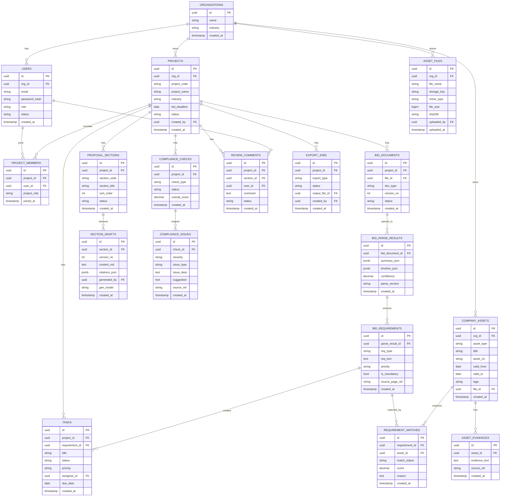

# 招投标智能辅助系统（Bidding Copilot）

## 1. 项目计划书（V1.0）

### 1.1 项目名称与定位
- 项目名称：**标智通（Bidding Copilot）**
- 产品定位：面向建筑/环保/医疗/信息化等场景的**招投标智能辅助系统**，提供「读标解析 + 资料匹配 + 初稿生成 + 合规检查 + 人工审核」闭环。
- Slogan：**更快读标，更准编标，更稳审标**

### 1.2 目标用户
- 投标专员 / 标书专员
- 商务经理 / 售前工程师
- 部门负责人（审核与风控）
- 外包代编标团队

### 1.3 核心价值
- 缩短编标周期（目标：40%~70%）
- 降低漏项和废标风险
- 提升企业资料复用率与可追溯性
- 提高多项目并行的交付稳定性

### 1.4 产品边界（必须对外明确）
本系统是**智能辅助和风控工具**，不是“自动中标系统”或“完全替代人工决策系统”。
最终投标文件由人工审核、确认、定稿。

### 1.5 商业模式建议
- SaaS：按账号/按项目数计费
- 私有化部署：实施费 + 年服务费
- 行业模板包：建筑版、医疗版、政府采购版
- 增值服务：资料治理、模板沉淀、流程定制

### 1.6 分阶段路线图

#### Phase 1（0~8周）读标解析与清单化
- 上传招标文件（PDF/Word）
- 提取关键信息、资质要求、评分项、废标项
- 输出投标准备清单与风险提示
- 支持人工修订与报告导出

#### Phase 2（9~16周）企业资料库与智能匹配
- 建设资料中心：资质、业绩、人员、财务、授权
- 自动匹配要求与证据，输出缺失项
- 建立有效期与到期提醒能力

#### Phase 3（17~24周）章节初稿生成
- 先覆盖固定章节（公司介绍、业绩、实施方案、售后）
- 基于历史模板与资料生成初稿
- 提供段落来源追溯与人工改写锁定

#### Phase 4（25~32周）合规检查与高质量导出
- 一致性检查、逐条响应检查、风险分级
- Word 样式规范化、目录页码自动化
- 导出 Word/PDF 与归档包

### 1.7 核心KPI
- 关键字段解析准确率 ≥ 90%
- 资质条款召回率 ≥ 92%
- 初稿可用率 ≥ 70%
- 编标时长下降 ≥ 50%
- 次月留存率 ≥ 60%

---

## 2. 开发需求清单（V1）

### 2.1 功能需求（FR）

#### FR-01 账号与权限
- 用户登录、组织隔离、角色权限（管理员/编标员/审核员）
- 项目级权限控制与操作审计日志

#### FR-02 项目管理
- 新建项目（项目名、编号、行业、截止时间）
- 项目状态流转（进行中/待审核/已完成）
- 文件管理（招标文件、附件、版本）

#### FR-03 招标文件解析
- 支持 PDF/Word 上传；扫描件 OCR
- 提取：基本信息、时间节点、资质要求、评分办法、废标项、技术参数
- 结构化结果可人工编辑与确认

#### FR-04 清单与任务化
- 自动生成：资料清单、风险清单、关键时间节点
- 支持任务分配、优先级与截止提醒

#### FR-05 企业资料库
- 资料分类管理：资质/许可证/业绩/人员/财务/授权
- 元数据：有效期、发证机构、适用范围、标签
- 检索：全文 + 条件过滤 + 相似语义检索

#### FR-06 资料匹配引擎
- 对每条招标要求给出：已匹配/待补齐/低置信度
- 显示匹配理由与证据片段

#### FR-07 标书初稿生成
- 按章节生成初稿（可配置模板）
- 支持语气/篇幅偏好
- 段落来源可追溯；支持人工改写后锁定

#### FR-08 合规检查
- 检查漏项、逐条响应、命名一致性、参数完整性、风险措辞
- 输出风险等级（高/中/低）与修复建议

#### FR-09 审核工作台
- 读标要求树、内容编辑区、风险与证据侧栏联动
- 逐条通过/退回、批注、版本比对

#### FR-10 导出归档
- 导出 Word/PDF
- 归档包（正文 + 附件清单 + 审核记录）

### 2.2 非功能需求（NFR）
- 性能：200页文档解析 P95 ≤ 3分钟
- 可用性：核心服务可用性 ≥ 99.5%
- 安全：TLS、敏感文件加密、细粒度权限、审计日志
- 可观测：日志、指标、告警
- 部署：支持 SaaS 与私有化

---

## 3. 数据库表结构设计（ER 图级别）

> 说明：以下为 MVP 可落地的数据模型。建议 PostgreSQL + pgvector（可选）+ 对象存储（S3/OSS/MinIO）。

### 3.1 核心实体关系（Mermaid ER）



### 3.2 建模说明（MVP关键点）
- `BID_REQUIREMENTS` 是后续任务、匹配、检查的核心枢纽。
- `REQUIREMENT_MATCHES` 支持“一条要求匹配多个证据”。
- `SECTION_DRAFTS` 支持版本化，满足审核可回溯。
- `COMPLIANCE_ISSUES` 与页面风险面板一一对应，便于闭环处理。

---

## 4. API 清单（OpenAPI 风格，MVP）

> Base URL：`/api/v1`

### 4.1 认证与用户

#### `POST /auth/login`
- 请求体：`{ email, password }`
- 响应：`{ access_token, refresh_token, user }`

#### `GET /users/me`
- 响应：当前用户信息 + 组织 + 角色

### 4.2 项目管理

#### `POST /projects`
- 创建项目
- 请求体：
```json
{
  "project_code": "ZB-2026-001",
  "project_name": "某医院设备采购项目",
  "industry": "医疗",
  "bid_deadline": "2026-05-20"
}
```
- 响应：`201 Created` + `project`

#### `GET /projects`
- 查询项目列表（支持状态、行业、关键词过滤）

#### `GET /projects/{project_id}`
- 项目详情

#### `PATCH /projects/{project_id}`
- 更新项目基础信息/状态

### 4.3 文件上传与招标文件

#### `POST /files/upload`
- `multipart/form-data`
- 返回 `file_id`

#### `POST /projects/{project_id}/bid-documents`
- 绑定上传文件为招标文档版本
- 请求体：`{ file_id, doc_type, version_no }`

#### `POST /bid-documents/{bid_document_id}/parse`
- 触发解析任务（异步）
- 响应：`{ job_id, status: "queued" }`

#### `GET /parse-jobs/{job_id}`
- 查询解析任务状态与结果摘要

#### `GET /bid-documents/{bid_document_id}/requirements`
- 获取提取出的要求清单（分页/过滤）

#### `PATCH /requirements/{requirement_id}`
- 人工修订要求条目（文本、必选、优先级）

### 4.4 任务与清单

#### `POST /projects/{project_id}/tasks/auto-generate`
- 根据要求自动生成任务清单

#### `GET /projects/{project_id}/tasks`
- 获取任务列表（按状态/负责人过滤）

#### `PATCH /tasks/{task_id}`
- 更新状态、负责人、截止时间

### 4.5 企业资料库

#### `POST /company-assets`
- 新增资料条目
- 请求体：
```json
{
  "asset_type": "qualification",
  "title": "机电工程施工总承包二级",
  "asset_no": "A123456",
  "valid_from": "2024-01-01",
  "valid_to": "2027-01-01",
  "file_id": "uuid"
}
```

#### `GET /company-assets`
- 资料检索（类型、有效期、关键词）

#### `PATCH /company-assets/{asset_id}`
- 更新资料元数据

### 4.6 要求匹配

#### `POST /projects/{project_id}/matches/run`
- 对项目要求执行自动匹配
- 响应：`{ job_id }`

#### `GET /projects/{project_id}/matches`
- 返回每条要求的匹配结果：`matched / missing / low_confidence`

#### `PATCH /matches/{match_id}`
- 人工确认/驳回匹配

### 4.7 章节与初稿

#### `POST /projects/{project_id}/sections/init`
- 初始化章节目录（按行业模板）

#### `GET /projects/{project_id}/sections`
- 获取章节树

#### `POST /sections/{section_id}/drafts/generate`
- 生成章节初稿（异步可选）

#### `GET /sections/{section_id}/drafts`
- 获取章节草稿版本列表

#### `POST /sections/{section_id}/drafts`
- 人工保存新版本

### 4.8 合规检查

#### `POST /projects/{project_id}/compliance-checks/run`
- 触发检查（漏项、一致性、格式、风险）

#### `GET /projects/{project_id}/compliance-checks/latest`
- 获取最近一次检查结果

#### `GET /compliance-checks/{check_id}/issues`
- 获取问题明细（按严重级别过滤）

### 4.9 审核与批注

#### `POST /projects/{project_id}/review-comments`
- 新增批注（章节、文本锚点、意见）

#### `GET /projects/{project_id}/review-comments`
- 查询批注列表

#### `PATCH /review-comments/{comment_id}`
- 更新批注状态（open/resolved）

### 4.10 导出

#### `POST /projects/{project_id}/exports`
- 创建导出任务（`word`/`pdf`/`archive`）

#### `GET /exports/{export_id}`
- 查询导出任务状态与下载链接

---

## 5. MVP 原型页面清单（页面字段 + 交互）

### P-01 登录页
**字段**
- 邮箱
- 密码

**交互**
- 登录成功跳转项目列表
- 失败提示（账号/密码错误）

### P-02 项目列表页
**字段**
- 项目名称、项目编号、行业、截止时间、当前状态、负责人

**交互**
- 搜索/筛选（状态、行业）
- 新建项目
- 进入项目详情

### P-03 新建项目弹窗/页面
**字段**
- 项目名称、编号、行业、招标截止时间、备注

**交互**
- 创建后进入项目工作台

### P-04 项目工作台（总览）
**模块**
- 项目关键时间轴
- 解析完成率
- 资料匹配率
- 风险问题数（高/中/低）
- 待办任务

**交互**
- 一键进入“读标解析 / 资料匹配 / 初稿生成 / 合规检查”

### P-05 招标文件上传与版本页
**字段**
- 文件名、版本号、上传时间、解析状态、上传人

**交互**
- 上传文件
- 触发解析
- 查看解析日志

### P-06 要求提取结果页（读标结果）
**字段**
- 要求类型（资质/评分/废标/技术）
- 原文片段
- 置信度
- 必须项标识
- 来源页码

**交互**
- 人工编辑条目
- 标记“重点关注”
- 生成任务清单

### P-07 任务清单页
**字段**
- 任务标题、关联要求、优先级、负责人、截止时间、状态

**交互**
- 指派负责人
- 批量更新状态
- 逾期提醒

### P-08 企业资料库页
**字段**
- 资料类型、名称、编号、有效期、标签、上传时间

**交互**
- 新增资料
- 更新元数据
- 到期筛选
- 预览附件

### P-09 要求匹配页
**字段**
- 要求条目
- 匹配状态（已匹配/缺失/低置信）
- 匹配证据
- 匹配分数

**交互**
- 重新匹配
- 人工确认/驳回
- 快速创建“缺失补齐任务”

### P-10 章节编辑页（初稿生成）
**布局**
- 左侧：章节树
- 中间：正文编辑器
- 右侧：引用证据 + AI建议 + 风险提示

**交互**
- 生成初稿
- 保存版本
- 对比版本差异
- 锁定已确认段落

### P-11 合规检查页
**字段**
- 检查项、严重等级、问题描述、修复建议、定位位置

**交互**
- 一键定位到对应章节
- 标记已修复
- 重新检查

### P-12 审核中心页
**字段**
- 审核意见、批注位置、处理状态、处理人

**交互**
- 添加批注
- @成员协作
- 通过/退回章节

### P-13 导出页
**字段**
- 导出类型（Word/PDF/归档包）
- 模板选择
- 导出任务状态

**交互**
- 发起导出
- 下载文件
- 查看导出失败原因

---

## 6. 建议的首批开发顺序（MVP两周冲刺）
1. 登录与项目管理（P-01~P-04）
2. 文件上传+解析任务（P-05~P-06）
3. 任务清单与资料库基础能力（P-07~P-08）
4. 匹配页基础版（P-09）
5. 导出报告基础版（P-13，先 PDF）

---

## 7. 算法内核设计（产品可用性的核心）

> 目标：让系统从“可演示”升级到“可稳定交付”。
> 原则：可解释、可追溯、可复核、可迭代，不追求纯自动化替代人工。

### 7.1 必须具备的六大算法能力

#### A. 招标文件结构化解析引擎（Document Intelligence）
**要解决的问题**
- PDF/Word/扫描件内容复杂，规则分散，人工阅读成本高且易漏项。

**算法能力**
- OCR 与版面结构识别（标题层级、表格、图片注释、附件目录）
- 段落切分与章节定位（含页码/段落坐标）
- 关键信息抽取：时间节点、资质要求、评分项、废标项、技术参数
- 要求条目归类与标准化（`req_type`、`priority`、`is_mandatory`）
- 条目置信度估计（confidence）

**输出结果（结构化）**
- requirement 列表（可编辑）
- source 引用（页码、原文片段、坐标）
- parse quality 报告（低置信度清单）

---

#### B. 资料检索与证据匹配引擎（Retrieval + Ranking）
**要解决的问题**
- 企业资料多而杂，人工从资料库找证据效率低、稳定性差。

**算法能力**
- 混合召回：关键词检索（BM25）+ 向量检索（Embedding）
- 重排模型（Cross-Encoder 或 reranker）提升 Top-K 精度
- 匹配打分与状态判定：`matched / missing / low_confidence / expired`
- 证据片段抽取与高亮（为何匹配、匹配到哪句话）

**输出结果（业务可用）**
- 每条 requirement 的候选证据列表
- match score + reason + evidence span
- 缺失项自动进入待补齐任务池

---

#### C. 合规审查引擎（Rules + LLM Hybrid）
**要解决的问题**
- 投标文本常见问题是“漏回应、回应不完整、术语不一致、风险措辞”。

**算法能力**
- 确定性规则检查：字段完整性、命名一致性、数值单位一致性、逐条响应覆盖率
- 语义审查：回答充分性、偏题识别、风险措辞识别
- 严重级别评估：`pass / warning / fail`
- 修复建议生成（定位 + 改写建议）

**输出结果**
- issue 列表（包含定位位置与严重等级）
- 按章节/按条款的覆盖率与通过率
- 可复检（再次执行并对比结果）

---

#### D. 风险识别与优先级引擎（Risk Scoring）
**要解决的问题**
- 风险并非“有没有”，而是“先处理哪个、谁负责、何时关闭”。

**算法能力**
- 风险识别（法律/技术/商务/运营）
- 多因子打分：影响度 × 紧急度 × 可修复性
- 风险处置建议与责任人推荐（owner suggestion）
- 风险闭环状态机：`open -> mitigated -> resolved`

**输出结果**
- 风险清单（可排序）
- 高风险 TOPN 与建议动作
- 项目级风险分值（riskScore）与趋势

---

#### E. 受约束章节生成引擎（Grounded Drafting）
**要解决的问题**
- 初稿要“可用可改可追溯”，不是泛泛而谈。

**算法能力**
- 模板驱动生成（章节目标、语气、篇幅、行业风格）
- 检索增强生成（RAG）：仅基于已确认 requirement/asset/evidence
- 段落来源标注（citation）
- 已确认段落锁定（避免回归覆盖）

**输出结果**
- 可编辑初稿（章节级）
- 段落来源映射（证据链）
- 版本差异与回滚能力

---

#### F. 置信度校准与持续学习引擎（Quality & Learning）
**要解决的问题**
- 系统必须知道“自己哪里不确定”，并让人工接管。

**算法能力**
- 置信度校准（Platt/Isotonic 等）
- 不确定性路由（低置信自动进人工复核队列）
- 反馈学习：人工确认/驳回反哺匹配与抽取模型
- 线上评估看板（准确率、召回率、误报率、修复成功率）

**输出结果**
- 各模块质量指标
- 可解释失败样本集
- 模型版本与效果对比报告

---

### 7.2 必须配置的算法工作流（Human-in-the-loop）

#### 标准主流程（建议固定）
1. 文档上传与解析（异步任务）
2. 要求提取结果人工确认（编辑/标重点）
3. 资料匹配与缺失识别（生成补齐任务）
4. 章节初稿生成（带来源追溯）
5. 合规检查（规则 + 语义双检）
6. 风险审查与责任分派
7. 导出前门禁（readiness 达标后允许导出）
8. 人工反馈沉淀（改写、驳回、修复结果回流）

#### 门禁策略（建议）
- 低置信 requirement 不得直接进入自动生成
- `fail` 级合规问题未关闭，禁止导出
- 高风险项无 owner，禁止提交最终版本

---

### 7.3 算法服务形态建议（落地实现）

#### 服务拆分（推荐）
- Parse Service（解析）
- Match Service（匹配）
- Compliance Service（审查）
- Risk Service（风险）
- Draft Service（生成）
- Eval Service（质量评估）

#### 平台能力
- 异步任务队列（解析/生成/复检）
- 特征与向量存储（PostgreSQL + pgvector 可选）
- 提示词与规则版本管理
- 模型版本灰度发布与回滚

---

### 7.4 首期优先级（算法视角）

**P0（必须先做）**
1. 结构化解析（A）
2. 混合检索+重排匹配（B）
3. 规则优先的合规检查（C）

**P1（快速增强）**
4. 风险排序与责任建议（D）
5. 受约束初稿生成（E）

**P2（持续提升）**
6. 置信度校准 + 反馈学习闭环（F）

---

### 7.5 验收指标（建议纳入里程碑）
- 要求抽取准确率（字段级）≥ 90%
- 关键资质条款召回率 ≥ 92%
- 匹配 Top-3 命中率 ≥ 85%
- 合规漏检率 ≤ 5%
- 初稿“可直接编辑”通过率 ≥ 70%
- 高风险问题闭环时长中位数下降 ≥ 40%
